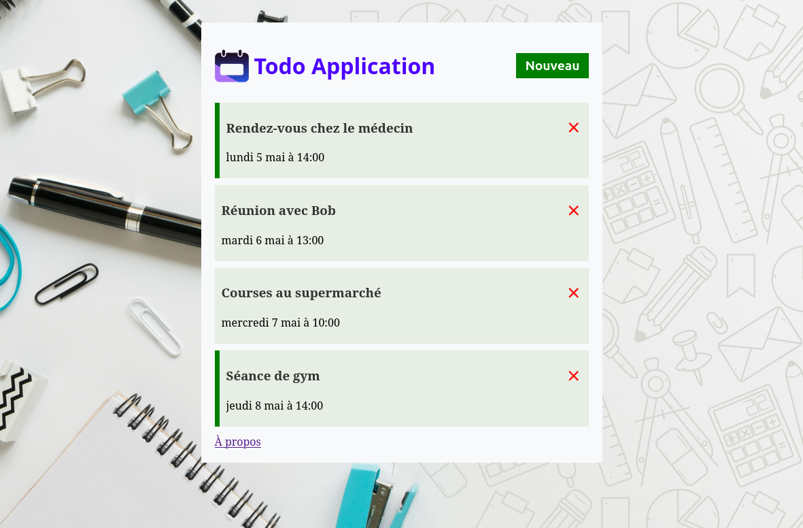

# ✅ Projet TodoApp (Angular + JSON Server)

     

---

## 📖 Description
**TodoApp** est une application web moderne de gestion de tâches développée avec **Angular 20**.  
Les tâches sont **stockées dans un fichier `db.json` et gérées via une API REST simulée avec [json-server](https://github.com/typicode/json-server)**.  

---

## 🚀 Fonctionnalités


#### ✅ Ajouter une tâche avec un titre  
#### ✅ Afficher dynamiquement la liste des tâches via `@for`  
#### ✅ Supprimer une tâche en base (`db.json`)  
#### ✅ Communication avec une **API REST mockée** grâce à `json-server`  

---

## 🛠️ Technologies utilisées
- 🅰️ **Angular 20** — Framework front-end  
- 🟦 **TypeScript** — Langage principal  
- 📦 **JSON Server** — API REST fake pour simuler un backend  
- ⚡ **Node.js (20+)** — Environnement 

---

## 📦 Installation et Utilisation

### 1️⃣ Cloner le projet
```sh
git clone https://github.com/ton-profil/todoapp.git
cd todoapp

```

### 2️⃣ Installer les dépendances
```sh
npm install
```

### 3️⃣ Lancer l'API JSON Server

Le fichier __db.json__ contient les tâches (stockage local). 
```sh
npm npx json-server --watch db.json --port 3000
```

➡️ L’API sera disponible à l’adresse :
-   `GET http://localhost:3000/tasks`
-   `POST http://localhost:3000/tasks`
-   `DELETE http://localhost:3000/tasks/:id`

### 4️⃣ Lancer l’application Angular
```sh
ng serve
```

➡️ Ouvrir dans le navigateur 👉 [http://localhost:4200](http://localhost:4200)

## 📂 Structure du projet
```bash
/todoapp
├── /src
│   ├── /app
│   │   ├── /components
│   │   │   ├── /about
│   │   │   ├── /add-task
│   │   │   ├── /button
│   │   │   ├── /header
│   │   │   ├── /task-item
│   │   │   └── /tasks
│   │   ├── /services
│   │   ├── app.config.ts
│   │   ├── app.css
│   │   ├── app.html
│   │   ├── app.routes.ts
│   │   ├── app.spec.ts
│   │   ├── app.ts
│   │   └── Tasks.ts      # Interface de la structure d'une tâche
│   ├── index.html
│   ├── main.ts
│   └── styles.css
├── angular.json
├── db.json               # Base de données locale (JSON Server)
├── package.json
├── README.md
├── tsconfig.app.json
├── tsconfig.json
└── tsconfig.spec.json
```

---

## 🎨 Aperçu de l'Interface


---

## 📊 Exemple d’Utilisation

1.  Ajout d’une tâche avec un titre
2.  Persistance de la tâche dans `db.json` via **JSON Server**
3.  Suppression d’une tâche → mise à jour en base locale

----------

## 🔮 Améliorations Futures

> [!NOTE]
> 
> -   Ajouter la modification d’une tâche (PUT / PATCH)
> -   Ajouter un filtre pour les tâches terminées / en cours
> -   Persister les données dans une vraie base (ex: MySQL, MongoDB)
> -   Déployer une version en ligne (Netlify / Vercel + API hébergée)
> -   Ajouter **TailwindCSS** pour une site bien responsive
>     
----------

## Auteur
**Johan Alain**

[GitHub](https://github.com/johanalain11/)

## 📜 Licence

Ce projet est sous licence MIT.

----------

✨ **N’hésite pas à contribuer !**  
💡 **Suggestions et retours sont les bienvenus !** 😊  
📩 **Contact :** [LinkedIn](www.linkedin.com/in/johanalain11) | Email [jank092016@gmail.com](mailto:jank092016@gmail.com)

